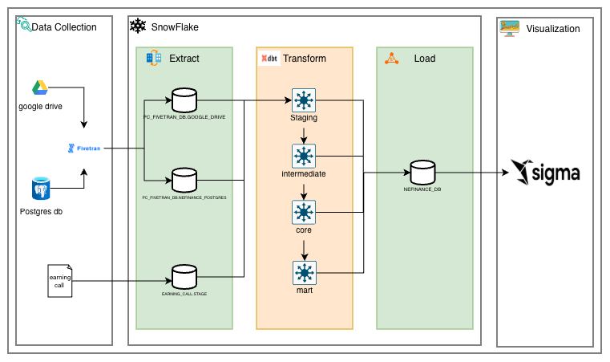
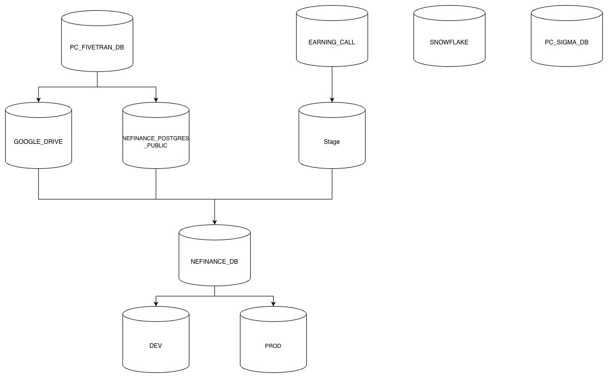

# [Fivetran-snowflake-dbt-sigma] NE Finance Intelligence

## Client Profile

| Field | Information |
| --- | --- |
| Company Name | NE Finance Intelligence |
| Industry | Financial watching and analysis SaaS |
| Need | Full data pipeline |
| Requirements | Easy to maintain; role-based security; embedded dashboard |
| Summary | NE Finance Intelligence needs a secure, maintainable data pipeline with embedded dashboard capability for financial watching and analysis. |

## Introduction

This project's goal is to build an end-to-end data pipeline for NE Finance Intelligence using Fivetran to load data from multiple data sources, including databases, Google Drive, and uploaded files, into Snowflake. Snowflake will be used as the main cloud data warehouse, while dbt will be used inside Snowflake to transform raw data into clean, structured, and analysis-ready models and finally use Sigma as visualization Hub. 

## Document Scope

| No. | Section | Description |
| --- | --- | --- |
| 1 | Pipeline Description | Describes how data moves from databases, Google Drive, and uploaded files through Fivetran into Snowflake, then through dbt transformations and visualization. |
| 2 | Snowflake Data Structure | Defines the Snowflake database, schemas, raw tables, staging models, marts, and analytical tables. |
| 3 | Role-Based Access Control (RBAC) | Explains access control by user roles, permissions, data ownership, and secure dashboard access. |
| 4 | Cost Control and Scale Plan | Covers warehouse sizing, auto-suspend, query optimization, storage management, and future scaling strategy. |
| 5 | CI/CD | Describes the development workflow for dbt models, testing, deployment, version control, and automated release process. |
| 6 | Plan to Improve | Lists future improvements for automation, monitoring, data quality, performance, and dashboard enhancement. |

## 1. Pipeline Description



- Step 1: Extract data from Database, google drive using Fivetran and load file Earning call to Snowflake stage. 
- Step 2: Transform data by using dbt
- Step 3: Storage transformed data in snowflake database
- Step 4: Visulization data using Sigma 

## 2. Snowflake Data Structure



 ### Layer 1 
 + **PC_FIVETRAN_DB**: raw ingestion database, Fivetran loads source data here include **GOOGLE_DRIVE** database and **NEFINANCE_POSTGRES_PUBLIC** database. 
 + **EARNING_CALL**: database storage raw TXT earning call file 
 + **SNOWFLAKE**: the system database for account metadata, query history, usage, roles, and governance information.
 + **PC_SIGMA_DB**: The Sigma integration/BI side

 ### Layer 2
 + **NEFINANCE_DB**: Data transformed will store here with **DEV** for development build and **PROD** for production build. 

 ## 3. Role-Based Access Control (RBAC)

 RBAC CURRENT STATE

### Current State

```text
ACCOUNTADMIN
+-- SYSADMIN
    +-- NEFINANCE_ADMIN_ROLE
    |   +-- Purpose: DDL on NEFINANCE_DB
    |
    +-- NEFINANCE_ANALYST_ROLE
    |   +-- Purpose: SELECT on DEV/PROD
    |   +-- User: NEFINANCE_ANALYST_USER
    |       +-- Type: PERSON
    |       +-- Default warehouse: COMPUTE_WH
    |
    +-- NEFINANCE_ETL_ROLE
    |   +-- Purpose: Read RAW, write DEV
    |   +-- User: NEFINANCE_ETL_USER
    |       +-- Type: PERSON
    |       +-- Default warehouse: DBT_WH
    |
    +-- PC_FIVETRAN_ROLE
    |   +-- Purpose: ETL ingestion
    |   +-- User: PC_FIVETRAN_USER
    |       +-- Type: SERVICE
    |       +-- Default warehouse: PC_FIVETRAN_WH
    |
    +-- PC_SIGMA_ROLE
        +-- Purpose: Sigma connector
        +-- User: PC_SIGMA_USER
            +-- Type: SERVICE
            +-- Default warehouse: PC_SIGMA_WH
```

### Admin User

```text
TUANNM
+-- Type: PERSON
+-- Default role: ACCOUNTADMIN
+-- Default warehouse: COMPUTE_WH
+-- Note: Overprivileged default role
```

